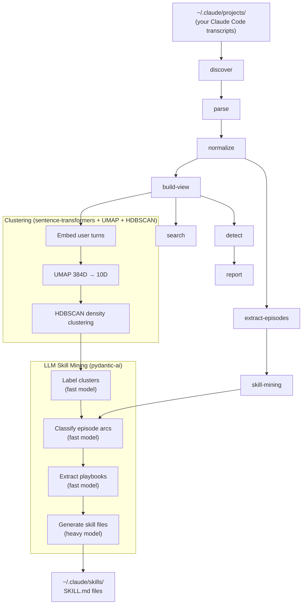

# Skill Drilla

Mine your Claude Code chat history to discover what you actually do, how you work, and what should become reusable skills.

## What you get

Run Skill Drilla against your Claude Code transcripts, and it produces:

- **Pattern report** — which instructions you repeat, what change requests recur, where you correct the agent
- **Conversation episodes** — every session reconstructed as a multi-turn thread (user + compressed assistant turns, tool context collapsed, subagents linked)
- **Semantic cluster map** — all your user turns grouped into 20-50 natural categories via sentence embeddings + UMAP + HDBSCAN (e.g. "run_next_milestone", "adversarial_plan_review", "test_driven_bugfix")
- **Workflow arc classifications** — each multi-turn episode tagged by shape: `multi_phase`, `plan_then_execute`, `debug_loop`, `iterative_refine`, `exploratory`
- **Playbook extractions** — the implicit step-by-step process you follow for complex tasks, with decision points and friction identified
- **Generated skill files** — actual Claude Code `SKILL.md` files ready to drop into `~/.claude/skills/`, built from every nuance and edge case found in your real conversations

## Pipeline



## Setup

### Requirements

- Python 3.11+
- Claude Code chat history (stored at `~/.claude/projects/` by default)
- An LLM API key for skill mining (any OpenAI-compatible endpoint)

### Install

```bash
git clone https://github.com/kingfly55/skill-drilla.git
cd skill-drilla
pip install -e '.[all]'
```

This installs the core pipeline plus clustering deps (`sentence-transformers`, `umap-learn`, `hdbscan`, `scikit-learn`, `matplotlib`) and LLM deps (`pydantic-ai`).

For the base pipeline only (pattern detection, episode extraction — no ML, no LLM):
```bash
pip install -e .
```

### Configure LLM models

Skill mining uses two models — a fast one for bulk analysis and a heavy one for skill file generation.

```bash
cp .env.example .env
```

Edit `.env`:
```bash
SKILLDRILLA_LLM_BASE_URL=https://api.openai.com/v1   # or your local endpoint
SKILLDRILLA_LLM_API_KEY=sk-your-key-here

# Fast model — cluster labelling, arc classification, nuance extraction
# Called 15-25 times. Should be cheap and fast.
SKILLDRILLA_LLM_MODEL=claude-haiku-4-5

# Heavy model — final skill file generation
# Called once per skill. Can take 5-20 minutes per call. Quality matters here.
SKILLDRILLA_LLM_MODEL_HEAVY=claude-opus-4-6
```

Any OpenAI-compatible API works — OpenAI, Anthropic via proxy, local models via llama.cpp/vllm/Ollama, etc.

### Verify your transcripts

```bash
ls ~/.claude/projects/
# You should see directories like: -home-user-my-project/
# Each containing .jsonl session files
```

## Running

### Step 1: Base pipeline

```bash
./run-analysis.sh
# or with a custom transcript path:
./run-analysis.sh /path/to/your/transcripts
```

Runs discover → parse → normalize → build views → detect patterns → extract episodes → generate report. Takes a few minutes depending on corpus size.

### Step 2: Clustering + skill mining (the good stuff)

```bash
jupyter notebook notebooks/06_skill_mining_analysis.ipynb
```

The notebook walks through embedding, clustering, LLM labelling, episode analysis, playbook extraction, and skill generation — all interactive so you can inspect and tune at each step.

### Alternative: CLI-only skill mining

```bash
skill-drilla semantic-run \
  --method skill-mining \
  --episode-dir artifacts/chat-analysis/episodes/default \
  --backend pydantic-ai \
  --disabled-by-default-check \
  --output-dir artifacts/chat-analysis/semantic/skill-mining
```

<details>
<summary>Full manual pipeline (individual commands)</summary>

```bash
skill-drilla discover --config configs/chat-analysis.default.yaml \
  --projects-root projects --output-dir artifacts/chat-analysis/discovery

skill-drilla parse --inventory artifacts/chat-analysis/discovery/session_inventory.jsonl \
  --output-dir artifacts/chat-analysis/parse

skill-drilla normalize \
  --inventory artifacts/chat-analysis/discovery/session_inventory.jsonl \
  --raw-events artifacts/chat-analysis/parse/raw_events.jsonl \
  --output-dir artifacts/chat-analysis/normalize

skill-drilla build-view \
  --evidence artifacts/chat-analysis/normalize/evidence.jsonl \
  --view user_nl_root_only \
  --output-dir artifacts/chat-analysis/views/user_nl_root_only

skill-drilla detect \
  --view-dir artifacts/chat-analysis/views/user_nl_root_only \
  --detector repeated_instructions \
  --output-dir artifacts/chat-analysis/detectors/repeated_instructions

skill-drilla extract-episodes \
  --evidence artifacts/chat-analysis/normalize/evidence.jsonl \
  --output-dir artifacts/chat-analysis/episodes

skill-drilla report \
  --detector-run artifacts/chat-analysis/detectors/repeated_instructions/detector_run.json \
  --output-dir artifacts/chat-analysis/reports
```

</details>

## Environment variables

| Variable | Default | Purpose |
|---|---|---|
| `SKILLDRILLA_LLM_BASE_URL` | `https://api.openai.com/v1` | OpenAI-compatible endpoint |
| `SKILLDRILLA_LLM_API_KEY` | _(empty)_ | API key for the endpoint |
| `SKILLDRILLA_LLM_MODEL` | `claude-haiku-4-5` | Fast model — labelling, classification, extraction (15-25 calls) |
| `SKILLDRILLA_LLM_MODEL_HEAVY` | `claude-opus-4-6` | Heavy model — skill file generation (1 per skill, 5-20 min each) |
| `SKILLDRILLA_EMBEDDING_MODEL` | `all-MiniLM-L6-v2` | Sentence-transformer for clustering (auto-downloads) |

## Detectors

| Detector | What it finds |
|---|---|
| `repeated_instructions` | Identical normalized instructions across sessions |
| `change_requests` | Recurring revision/update requests around the same focus |
| `refinement_requests` | Configuration and workflow refinement patterns |
| `workflow_patterns` | Repeated multi-step workflow sequences |
| `agent_failures` | Patterns in agent failure/recovery |
| `corrections_frustrations` | User corrections and frustration signals |
| `output_quality` | Output quality complaint patterns |

## Project structure

```
skill-drilla/
  src/skill_drilla/       # Core library (63 modules, zero core dependencies)
  tests/                  # Unit, integration, regression, performance tests
  schemas/                # JSON schema definitions for all artifact types
  configs/                # Default pipeline configuration
  notebooks/              # 6 Jupyter analysis notebooks
  docs/                   # User guide, architecture docs, operator guides
  run-analysis.sh         # One-command pipeline runner
  projects/               # Your chat transcripts go here (gitignored)
  artifacts/              # Generated pipeline output (auto-created)
```

## Troubleshooting

**"Could not find Claude Code transcripts"** — Claude Code stores transcripts at `~/.claude/projects/`. Pass a custom path: `./run-analysis.sh /path/to/transcripts`

**"ModuleNotFoundError: sentence_transformers"** — Install clustering extras: `pip install -e '.[semantic-local]'`

**"Empty API key"** — Copy `.env.example` to `.env` and add your LLM API key.

**Pipeline is slow** — Normal for large corpora. 500+ sessions takes a few minutes.

**Integration tests fail** — Run `./run-analysis.sh` first to generate the artifacts they depend on.

## Design principles

- **Zero core dependencies** — base pipeline runs on Python 3.11+ with nothing else
- **Local-first** — data never leaves your machine unless you configure an LLM endpoint
- **Traceable** — every finding → evidence_id → raw_event_id → exact transcript line
- **Non-canonical by default** — all LLM output is marked `non_canonical: true`

## License

MIT
