# Desired pipeline flow

This pipeline should work from the repository’s source-of-truth documents:

- Problem spec: `docs/specs/2026-03-30-chat-analysis-problem-spec.md`
- Requirements: `docs/specs/2026-03-29-chat-analysis-requirements.md`
- Architecture: `ARCHITECTURE.md`

## Flow

1. Load the problem spec, requirements, and architecture documents.
2. Run adversarial analysis round 1 on `ARCHITECTURE.md` against the problem spec.
3. Run adversarial analysis round 2 on `ARCHITECTURE.md` against the problem spec.
4. Generate an implementation plan using a small model, informed by both adversarial rounds and the requirements document.
5. Refine the implementation plan using a larger model.
6. Break the refined implementation plan into milestone-specific files.
7. Implement the milestone work using a small model.

## Diagram

```mermaid
flowchart TD
    PS[Problem spec\n2026-03-30-chat-analysis-problem-spec.md]
    REQ[Requirements\n2026-03-29-chat-analysis-requirements.md]
    ARCH[Architecture\nARCHITECTURE.md]

    AR1[Adversarial round 1\nArchitecture vs problem spec]
    AR2[Adversarial round 2\nArchitecture vs problem spec]
    PLAN1[Implementation plan generation\nsmall model]
    PLAN2[Implementation refinement\nlarger model]
    MILESTONES[Milestone file generation]
    IMPL[Milestone implementation\nsmall model]

    PS --> AR1
    ARCH --> AR1
    PS --> AR2
    ARCH --> AR2
    REQ --> PLAN1
    AR1 --> PLAN1
    AR2 --> PLAN1
    PLAN1 --> PLAN2
    REQ --> PLAN2
    PLAN2 --> MILESTONES
    MILESTONES --> IMPL
```

