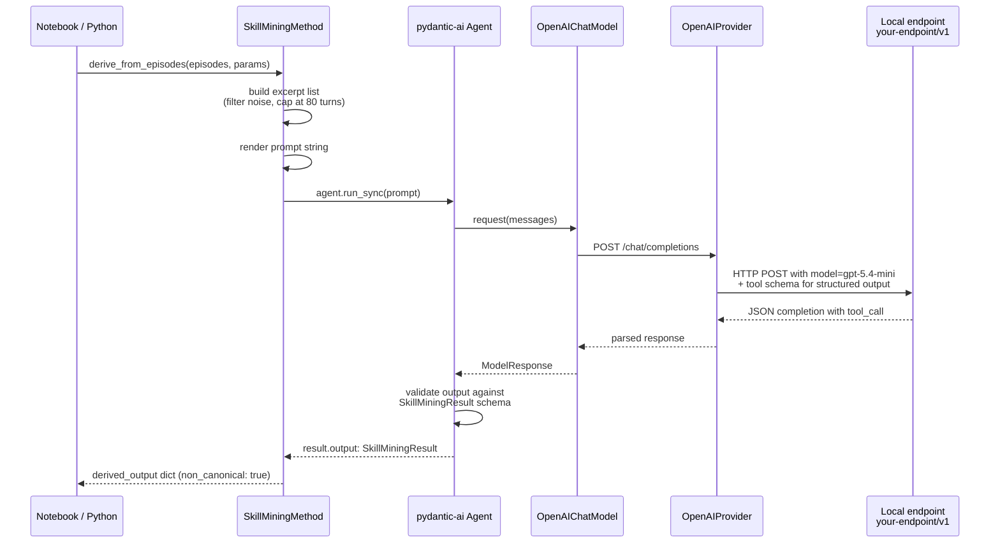
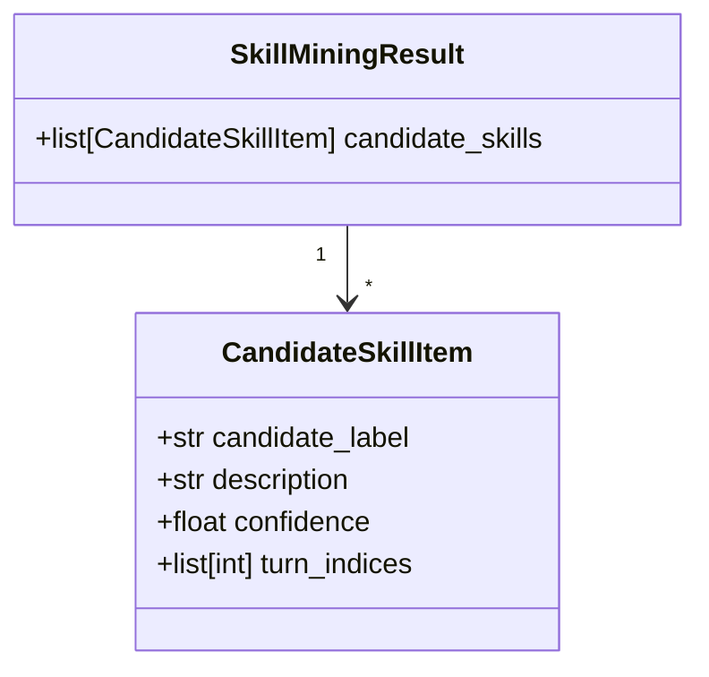
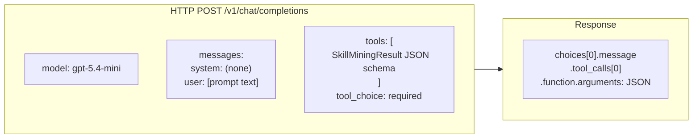
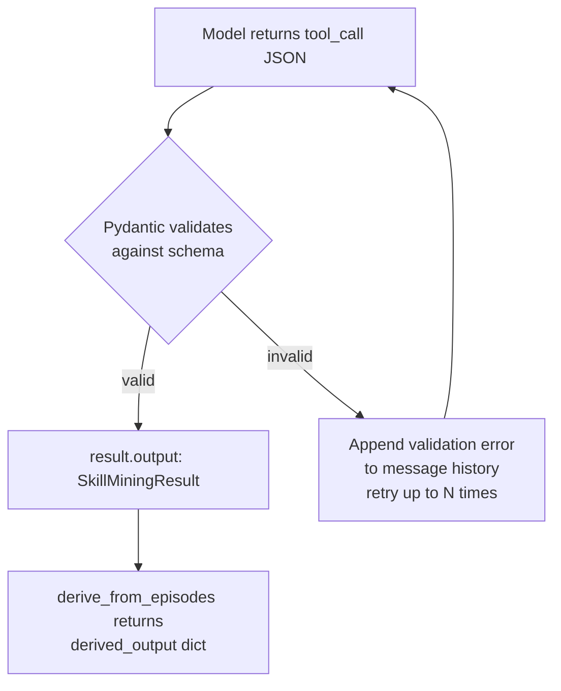
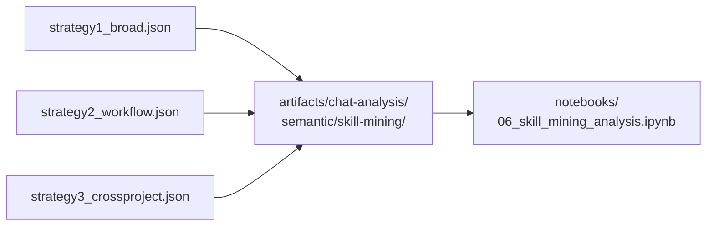

# Skill-Mining LLM Call Plan

This document diagrams every LLM call that will be made during the notebook analysis, how they are routed, and what structured output is expected from each.

---

## 1. Infrastructure: how a call reaches the model



---

## 2. Structured output schema (every strategy)

Every call uses the same Pydantic schema for tool-use structured output:



The model receives the schema as a JSON tool definition. It must call the tool with a valid payload — pydantic-ai validates the response and retries on schema violations.

---

## 3. Planned LLM calls for the notebook

Three strategies, three LLM calls. All use `gpt-5.4-mini` via `http://your-endpoint/v1`.

```mermaid
flowchart TD
    EV[evidence.jsonl\n132k rows] --> EX[extract-episodes CLI\n971 episodes · 1688 user turns]
    EX --> FILTER[Filter noise\nremove: short · interrupted · ide_selection\n→ ~1430 substantive turns]
    FILTER --> SAMPLE[Random sample 80 turns\nseed=42 for reproducibility]

    SAMPLE --> S1
    SAMPLE --> S2
    SAMPLE --> S3

    subgraph S1["Call 1 — Broad categorisation"]
        direction TB
        P1["Prompt focus:\nFind 15–25 recurring request categories.\nIgnore one-offs. Use snake_case labels."]
        R1["Expected output:\n15–25 skills\nhigh-level taxonomy\ncovers most of the corpus"]
        P1 --> R1
    end

    subgraph S2["Call 2 — Actionable workflow patterns"]
        direction TB
        P2["Prompt focus:\nFind specific, repeatable workflows —\nthings the developer does step-by-step.\nPrefer multi-turn patterns."]
        R2["Expected output:\n10–15 skills\nmore specific than S1\naction verbs dominant"]
        P2 --> R2
    end

    subgraph S3["Call 3 — Cross-project recurring asks"]
        direction TB
        P3["Prompt focus:\nFind patterns that appear across\ndifferent projects (not project-specific).\nEmphasise transferability."]
        R3["Expected output:\n10–20 skills\nproject-agnostic\nhighest-confidence candidates"]
        P3 --> R3
    end

    S1 --> COMP[Compare & synthesise\nin notebook]
    S2 --> COMP
    S3 --> COMP
    COMP --> NB[notebooks/06_skill_mining_analysis.ipynb]
```



---

## 4. Per-call request structure



pydantic-ai converts `output_type=SkillMiningResult` into a tool definition automatically. The model is forced to call it via `tool_choice: required`.

---

## 5. Retry / validation flow



pydantic-ai's `retries=1` default means one retry on schema violation before raising.

---

## 6. Output artifact written per strategy



Each JSON file has the shape:

```json
{
  "strategy": "...",
  "model": "gpt-5.4-mini",
  "non_canonical": true,
  "candidates": [
    {
      "label": "implement_next_milestone",
      "description": "...",
      "confidence": 0.91,
      "turn_indices": [1, 3, 4, 7, ...]
    }
  ]
}
```

All outputs carry `non_canonical: true` — they are LLM interpretations of canonical episode data, not canonical facts themselves.

---

## Summary table

| Call | Strategy | Prompt focus | Target skill count | Model |
|------|----------|-------------|-------------------|-------|
| 1 | Broad categorisation | High-level taxonomy of all request types | 15–25 | gpt-5.4-mini |
| 2 | Actionable workflow | Step-by-step repeatable workflows | 10–15 | gpt-5.4-mini |
| 3 | Cross-project recurring | Project-agnostic transferable patterns | 10–20 | gpt-5.4-mini |
